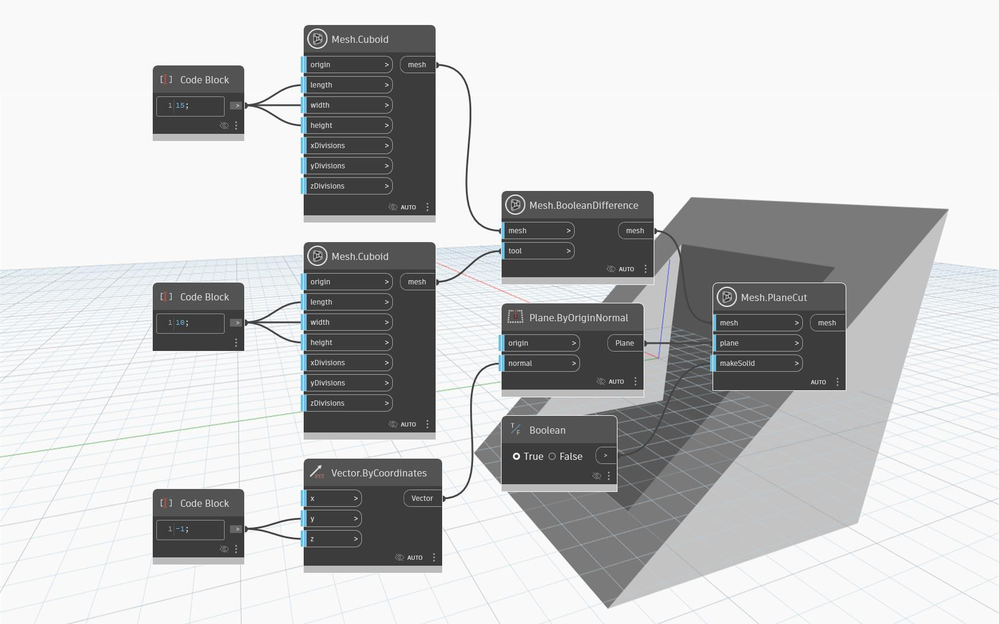

## 詳細
`Mesh.PlaneCut` は、指定された平面で切断されたメッシュを返します。切断の結果は、`plane` 入力で指定された平面上の法線方向にある側のメッシュとなります。`makeSolid` パラメータは、メッシュを `Solid` として扱うかどうかをコントロールします。この場合、切断された部分は、各穴を覆うために可能な限り少ない数の三角形で埋められます。

次の例では、`Mesh.BooleanDifference` 操作から得られた空洞メッシュを平面で斜めに切断しています。

## サンプル ファイル

