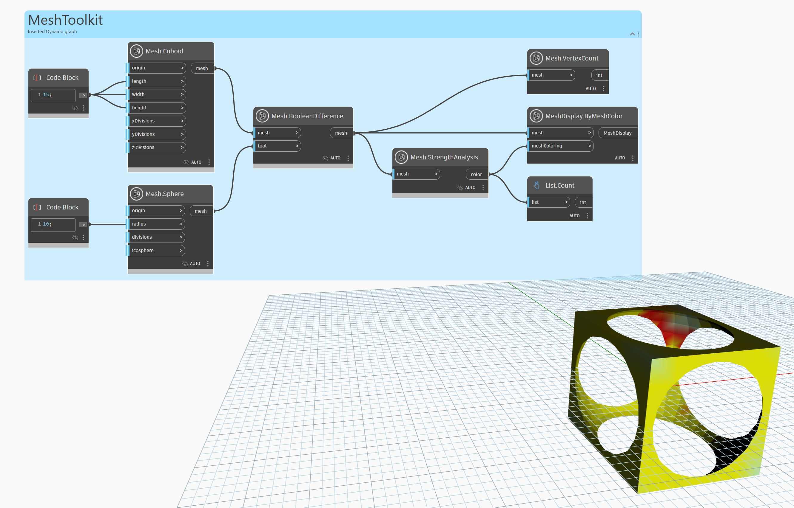

## 詳細
 `Mesh.StrengthAnalysis` ノードは、各頂点の代表的な色のリストを返します。その結果は、`Mesh.ByMeshColor` ノードとともに使用できます。メッシュの強い領域は緑色で示され、弱い領域は黄色から赤色へのヒート マップで示されます。メッシュが粗すぎたり不規則な場合(つまり、長くて薄い三角形が多数ある場合)は、分析の結果が誤検出される可能性があります。`Mesh.Remesh` を使用して規則的なメッシュを生成から `Mesh.StrengthAnalysis` を呼び出すと、より良い結果が得られます。

次の例では、`Mesh.StrengthAnalysis` を使用して、メッシュの構造強度をグリッド形状で色分けしています。結果として、メッシュの頂点の数に一致する色のリストが得られます。このリストを `Mesh.ByMeshColor` ノードと使用して、メッシュに色付けすることができます。

## サンプル ファイル

