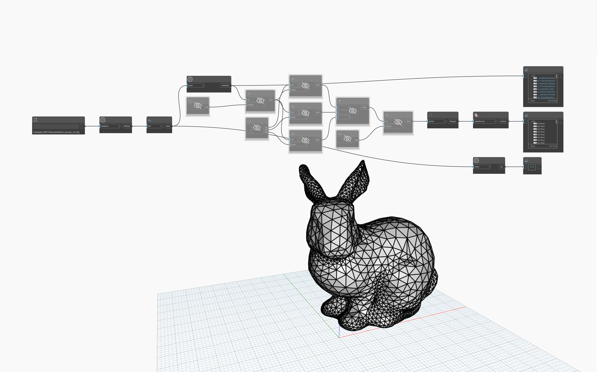

## 詳細
`Mesh.TrainglesAsNineNumbers` は、指定されたメッシュ内の各三角形を構成する頂点の X、Y、Z 座標を決定し、三角形ごとに 9 つの数値を出力します。このノードは、元のメッシュのクエリー実行、再構築、変換に役立ちます。

次の例では、`File Path` と `Mesh.ImportFile` を使用してメッシュをインポートした後、`Mesh.TrianglesAsNineNumbers` を使用して各三角形の頂点の座標を取得しています。次に、`List.Chop` を使用して `lengths` 入力に 3 を設定することで、リストを 3 分割します。次に、`List.GetItemAtIndex` を使用して各頂点の X、Y、Z 座標を取得し、`Point.ByCoordinates` を使用して頂点を再構築します。点のリストはさらに 3 分割され(各三角形に 3 点)、`Polygon.ByPoints` の入力として使用されます。

## サンプル ファイル

