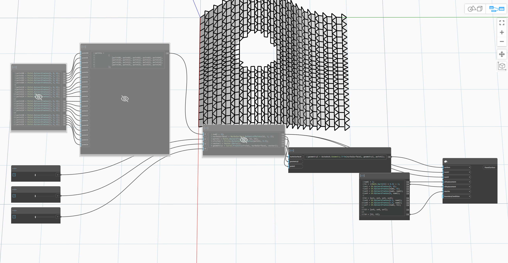

## 詳細
入力サーフェスをカスタム タイル パターンでパネル化します。タイルは UV パラメータ空間内のポリゴンです。凸型でないポリゴンは自己交差することはできません。タイルのセットがエッジ間で接している必要はありません。タイルのコピーを U 方向と V 方向に沿って指定された変位量で変位させることで、パネリング パターンが生成されます。各タイルの頂点の UV 座標は引数 tileUVs で指定されます。
___
## サンプル ファイル

