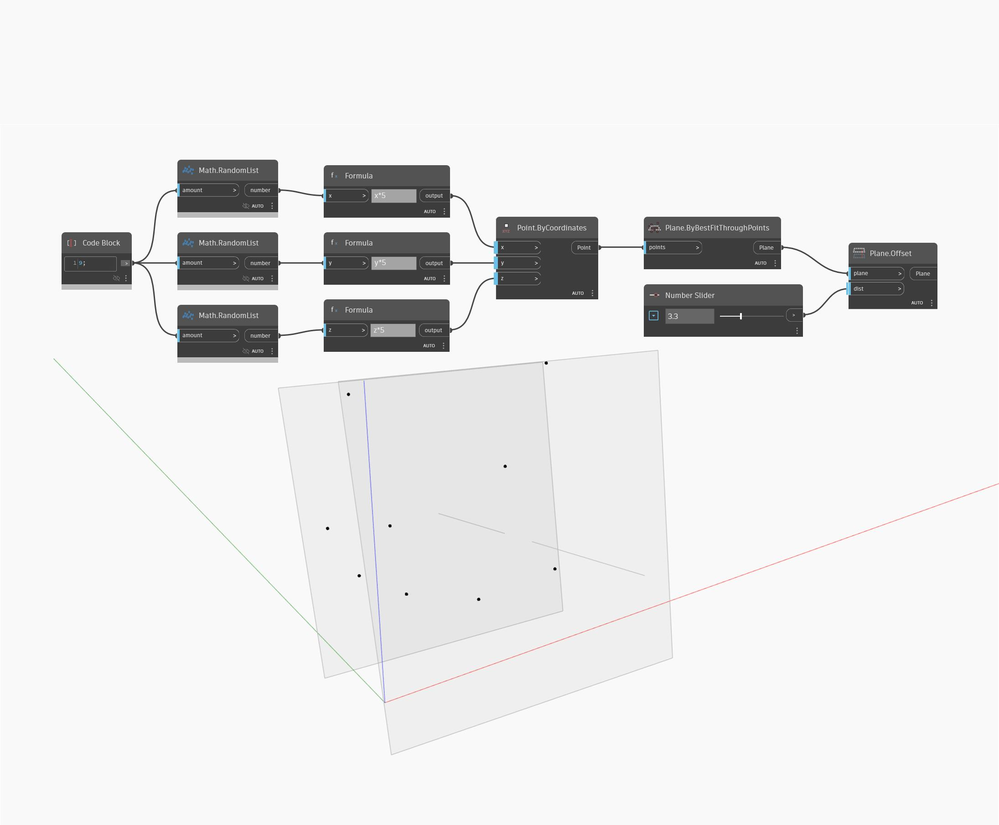

## 詳細
Offset は、入力されたサーフェスから、distance 入力によって指定された距離だけオフセットされた新しいサーフェスを作成します。正の距離を指定すると、サーフェスの Normal 方向にオフセットされたサーフェスが作成され、負の距離を指定すると、サーフェスの反対側にオフセットされたサーフェスが作成されます。次の例では、まず BySweep2Rails ノードを使用してサーフェス作成します。次に、数値スライダを使用して、Offset ノードでオフセットの距離をコントロールしています。
___
## サンプル ファイル

