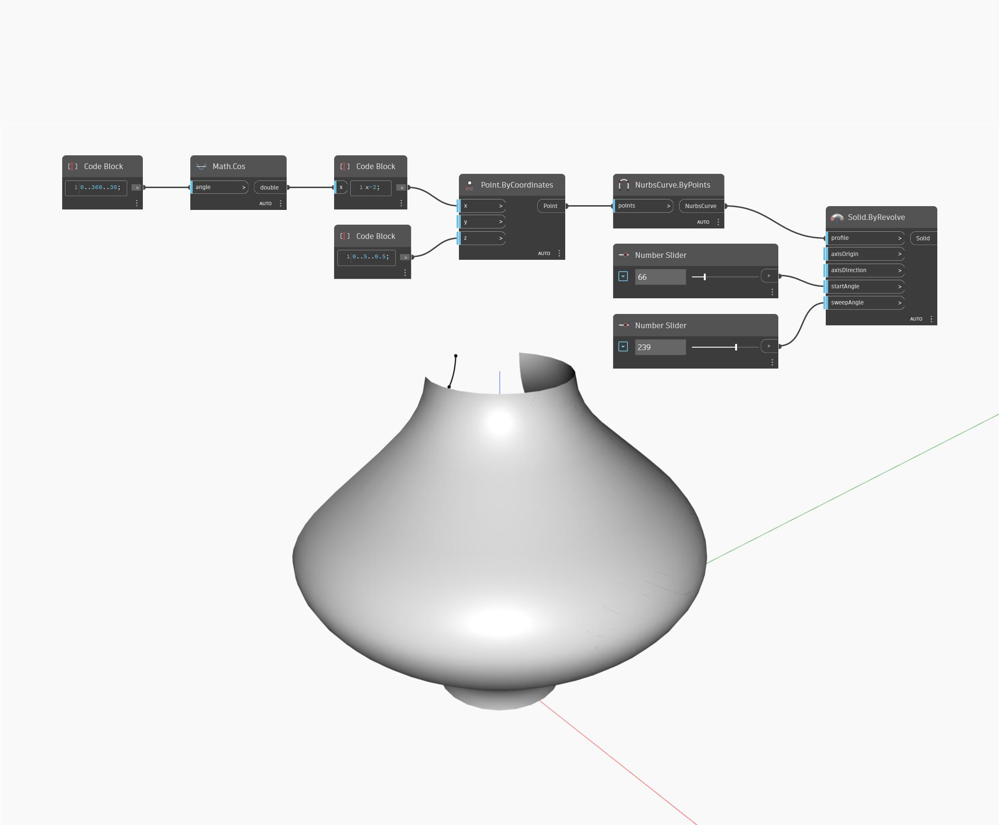

## 詳細
`Solid.ByRevolve` は、軸を中心に指定されたプロファイル曲線を回転させてサーフェスを作成します。軸は、`axisOrigin` 点と `axisDirection` ベクトルで定義します。startAngle はサーフェスを開始する位置(度単位で測定)を決定し、`sweepAngle` は軸を中心としてサーフェスが続く角度を決定します。

次の例では、余弦関数で生成された曲線をプロファイル曲線として使用し、2 つの数値スライダを使用して `startAngle` と `sweepAngle` をコントロールします。`axisOrigin` と `axisDirection` は、既定値(この例ではワールド座標系の原点と Z 軸)のままになっています。

___
## サンプル ファイル

