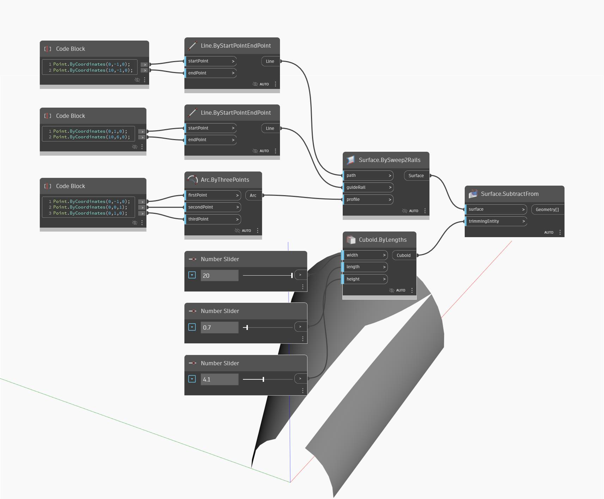

## 詳細
SubtractFrom は、入力されたサーフェスから入力されたトリム ジオメトリを減算して新しいサーフェスを作成します。次の例では、まず BySweep2Rails を使用してサーフェスを作成します。次に、一連の数値スライダを使用して、直方体の長さ、幅、高さをコントロールします。SubtractFrom ノードを使用すると、直方体と交差する領域を減算することでサーフェスをトリムできます。
___
## サンプル ファイル

