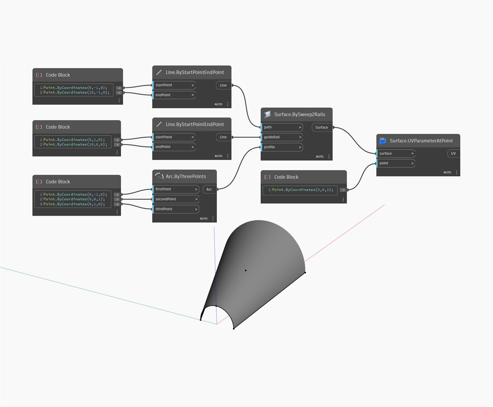

## 詳細
UVParameterAtPoint は、サーフェス上の入力された点におけるそのサーフェスの UV 位置を求めます。入力された点がサーフェス上にない場合は、このノードは入力された点に最も近いサーフェス上の点を求めます。次の例では、まず BySweep2Rails を使用してサーフェスを作成します。次に、Code Block を使用して UV パラメータを求める点を指定します。この点がサーフェス上にないため、ノードが UV パラメータを求める位置として、サーフェス上の最も近い点を使用しています。
___
## サンプル ファイル

