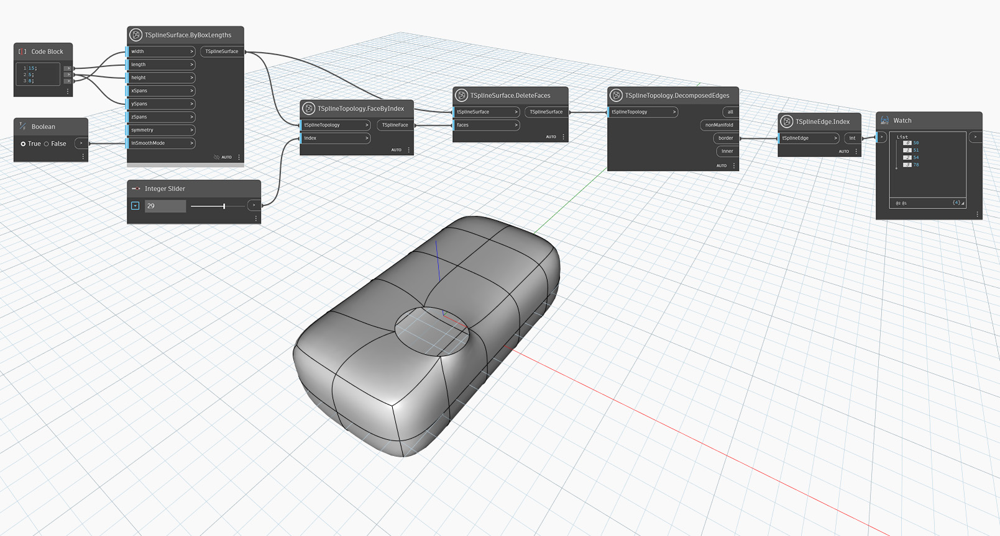

## In-Depth
T スプライン サーフェス トポロジでは、`Face`、`Edge`、`Vertex` のインデックスは、必ずしもリスト内の項目のシーケンス番号と一致しないことに注意してください。この問題に対処するには、ノード `TSplineSurface.CompressIndices` を使用します。

次の例では、`TSplineTopology.DecomposedEdges` を使用して T スプライン サーフェスの境界エッジを取得し、`TSplineEdge.Index` ノードを使用して、指定したエッジのインデックスを取得します。

## サンプル ファイル

