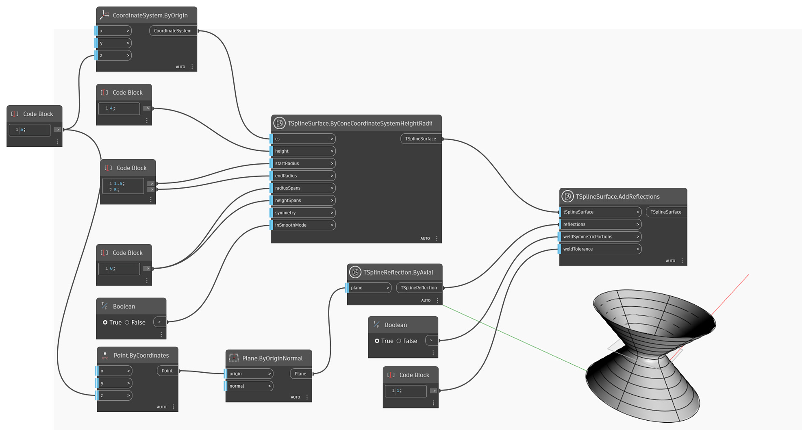

## In-Depth
`TSplineReflection.ByAxial` は `TSplineSurface.AddReflections` ノードの入力として使用できる `TSplineReflection` オブジェクトを返します。
`TSplineReflection.ByAxial` ノードの入力は、鏡像複写面として機能する平面です。TSplineInitialSymmetry や TSplineReflection と同様に、TSplineSurface に対して設定すると、その後の操作や変更のすべてに影響します。

次の例では、`TSplineReflection.ByAxial` を使用して T スプライン円錐の上部に配置される TSplineReflection を作成します。その反射は `TSplineSurface.AddReflections` ノードの入力として使用され、円錐を反射して新しい T スプライン サーフェスを返します。

## サンプル ファイル

