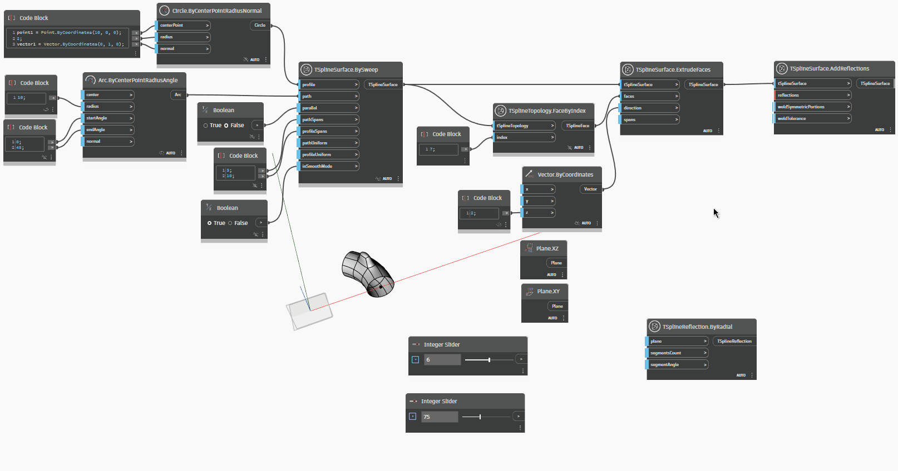

## In-Depth
`TSplineReflection.ByRadial` は、`TSplineSurface.AddReflections` ノードの入力として使用できる `TSplineReflection` オブジェクトを返します。ノードは平面を入力として受け取り、平面の法線がジオメトリを回転するための軸として機能します。TSplineInitialSymmetry と同様に、TSplineReflection は TSplineSurface の作成時に設定されると、その後のすべての操作と変更に影響を与えます。

次の例では、`TSplineReflection.ByRadial` を使用して T スプライン サーフェスの反射を定義します。`segmentsCount` および `segmentAngle` 入力は、指定した平面の法線を中心にジオメトリが反射される方法をコントロールするために使用されます。ノードの出力は、新しい T スプライン サーフェスを作成するために `TSplineSurface.AddReflections` ノードの入力として使用されます。

## サンプル ファイル

