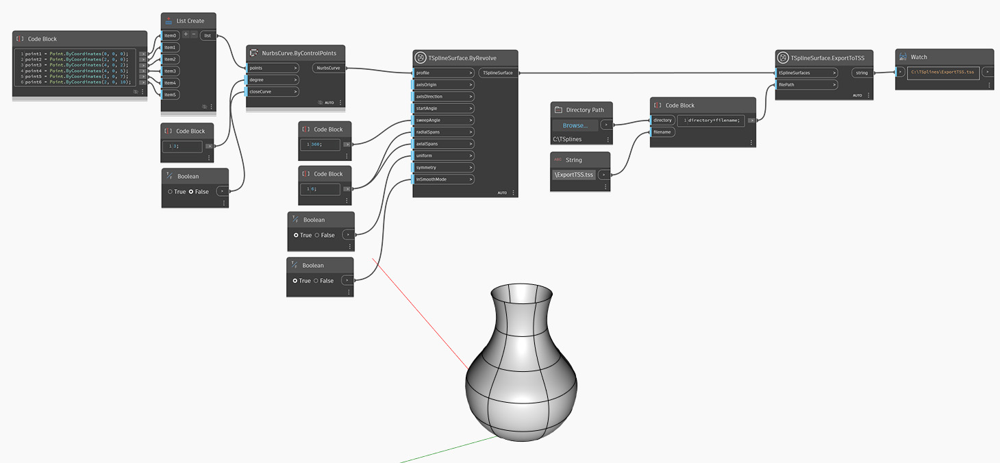

## 詳細
In the example below, a T-Spline surface is created using `TSplineSurface.ByRevolve`, with a NURBS curve as a profile.
ファイル パスを指定すると、サーフェスは `TSplineSurface.ExportToTSS` ノードを介して T スプライン シーン ファイルに書き出されます。
___
## サンプル ファイル

