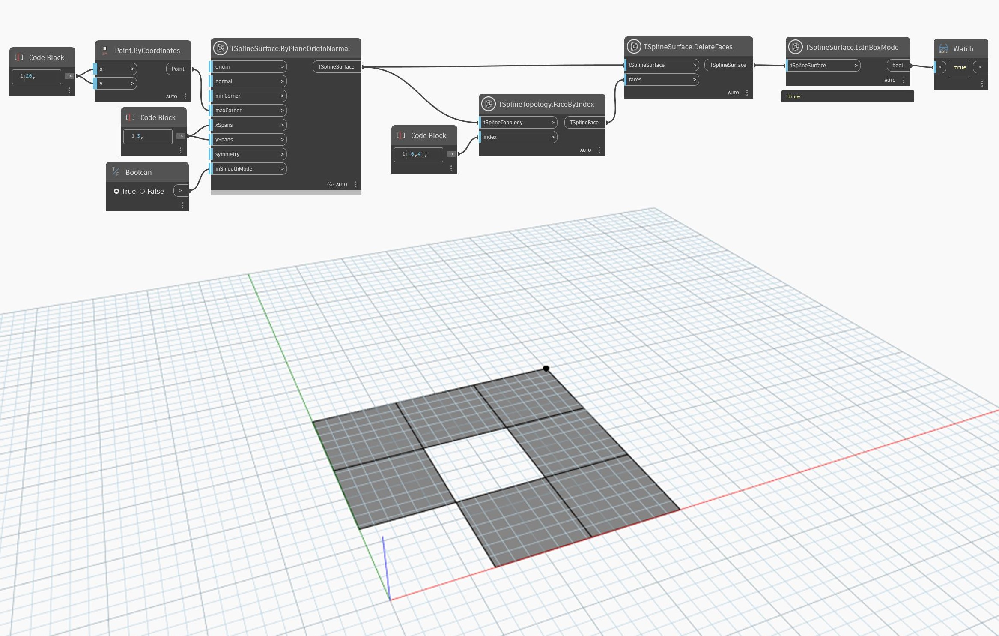

## In Depth
Box mode and smooth mode are two ways of viewing a T-Spline surface. Smooth mode is the true shape of a T-Spline surface and is useful for previewing the aesthetics and dimensions of the model. Box mode, on the other hand, can cast an insight onto the surface structure and give a better understanding of it, as well as being a faster option for previewing large or complex geometry. Box and smooth modes can be controlled at the moment of creating the initial T-Spline surface or later, with nodes like `TSplineSurface.EnableSmoothMode`. 

In cases where a T-Spline becomes invalid, its preview automatically switches to box mode. The node `TSplineSurface.IsInBoxMode` is another way to identify if the surface becomes invalid. 

In the example below, a T-Spline plane surface is created with `smoothMode` input set to true. Two of its faces are deleted, making the surface invalid. The surface preview switches to box mode, although it's impossible to tell from the preview alone. The node `TSplineSurface.IsInBoxMode` is used to confirm that the surface is in box mode.
___
## Example File

