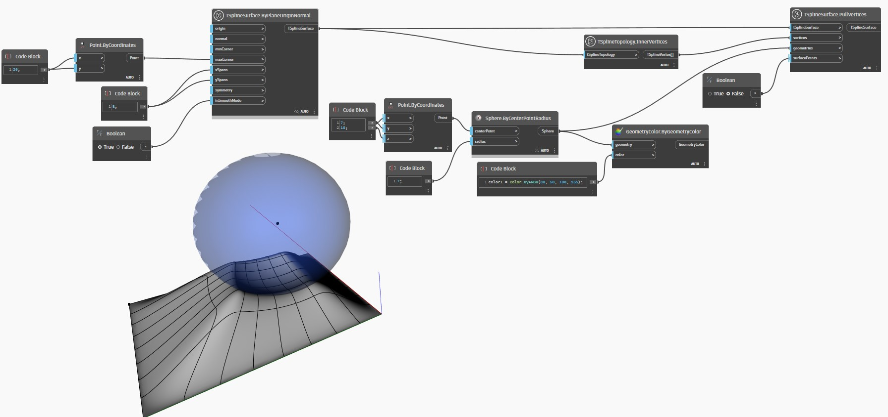

## 詳細
次の例では、`TSplineTopology.InnerVertices` ノードを使用して、T スプライン平面サーフェスの内側の頂点をすべて収集します。頂点は、それらが属するサーフェスとともに、`TSplineSurface.PullVertices` ノードの入力として使用されます。`geometry` 入力は、平面サーフェスの上にある球体です。`surfacePoints` 入力を False に設定し、制御点を使用してプル操作を実行します。
___
## サンプル ファイル

