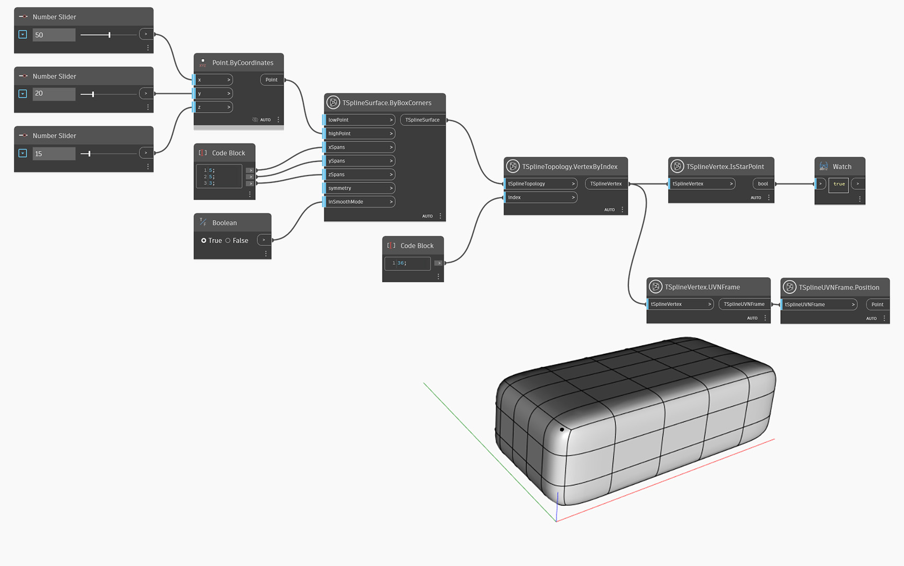

## In-Depth
`TSplineVertex.IsStarPoint` は、頂点がスター ポイントであるかどうかを返します。

スター ポイントは、3 つ、または 5 つ以上のエッジが集まったときに存在します。これはボックスまたはクワッドボールのプリミティブで自然に発生し、一般的には、T スプライン面の押し出し、面の削除、またはマージの実行時に生成されます。通常の頂点や T ポイント頂点と異なり、スター ポイントは、制御点の四角形の行でコントロールされません。スター ポイントを使用すると、周囲の領域のコントロールが困難になり、歪みを生成することがあるため、必要な場合にのみ使用してください。折り目がついたエッジ、曲率が大幅に変化する部分、開いたサーフェスのエッジなど、モデルのシャープな部分は、スター ポイントの配置に適していません。

スター ポイントは、T スプラインを境界表現(BREP)に変換する方法も決定します。T スプラインを BREP に変換すると、スター ポイントごとに個別のサーフェスに分割されます。

次の例では、`TSplineVertex.IsStarPoint` を使用して、`TSplineTopology.VertexByIndex` で選択された頂点がスター ポイントであるかどうかのクエリーを実行します。

## サンプル ファイル

