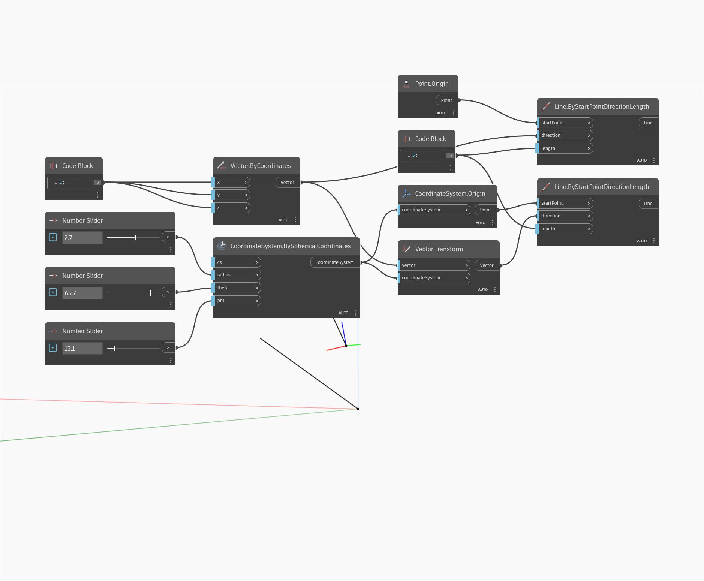

## 詳細
Transform は、入力された CoordinateSystem に基づいて新しい Vector を返します。次の例では、Vector が WorldCoordinateSystem から球面座標で定義された新しい CoordinateSystem に変換されます。スライダを調整して、新しい Vector を別の位置に移動してください。両方の Vector が Line として表現されています。
___
## サンプル ファイル

