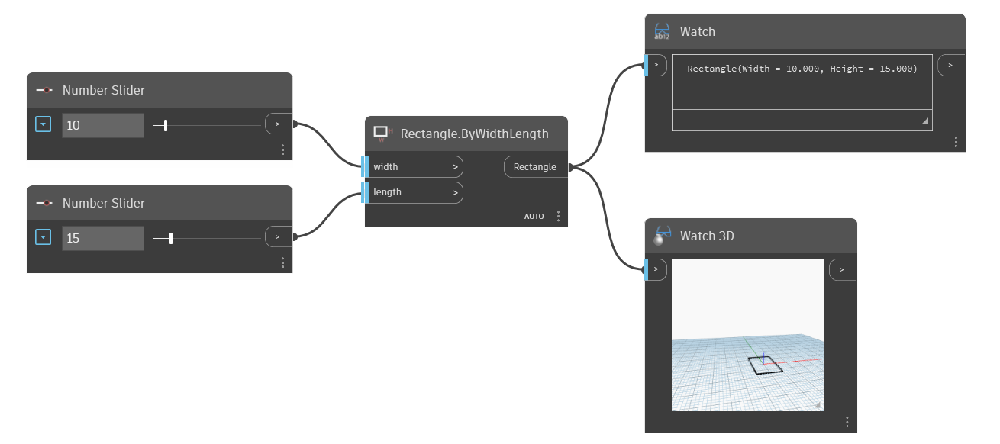

<!--- Autodesk.DesignScript.Geometry.Rectangle.ByWidthLength(width, length) --->
<!--- CMTCHCAMGXJZYOGATCJYXZM5UMWN5Y5GZ22WIK5267BVMYHEGSCQ --->
## 詳細
Rectangle.ByWidthLength ノードは、Z 軸を基準とする平面に、指定された長さと幅の寸法を持つ長方形を作成します。長方形の中心は通芯の原点に配置されます。次の例では、2 つの Number Slider を使用して長方形の形状を決めています。
___
## サンプル ファイル

