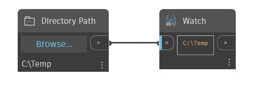

## 詳細
Directory Path を使用すると、コンピュータからフォルダを選択できます。フォルダ パスを設定するには、Directory Path ノードの[参照...]ボタンをクリックし、目的のフォルダにナビゲートします。このノードが以前に保存された .dyn ファイルに追加されると、このノードではその .dyn ファイルのフォルダが既定として設定されます。
___
## サンプル ファイル

