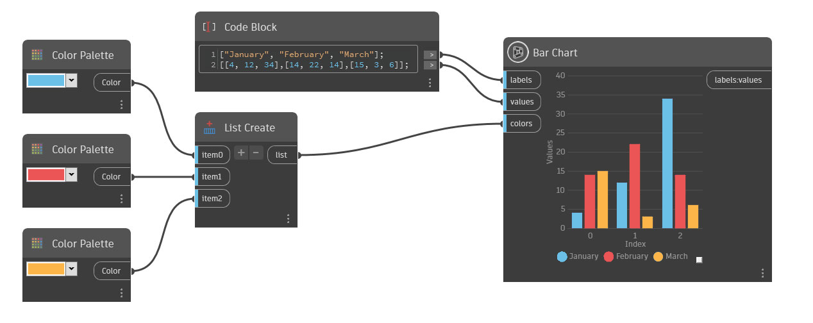

## 詳細

Bar Chart は、棒の向きが縦のグラフを作成します。棒は、複数のグループに整理し、色分けしてラベルを付けることができます。values 入力に、単一の倍精度値を入力して単一のグループを作成するか、サブリストで複数の倍精度値を入力して複数のグループを作成できます。カテゴリを定義するには、labels 入力に文字列値のリストを挿入します。値ごとに、色分けされた新しいカテゴリが作成されます。

各棒に値(高さ)を割り当てるには、values 入力に倍精度値を含むリストのリストを入力します。各サブリストによって棒の数が決まり、棒が属するカテゴリは labels 入力と同じ順序になります。倍精度値のリストが 1 つの場合は、1 つのカテゴリのみが作成されます。labels 入力の文字列値の数は values 入力のサブリストの数と一致する必要があります。

各カテゴリに色を割り当てるには、colors 入力に色のリストを挿入します。カスタム色を割り当てる場合は、色の数は labels 入力の文字列値の数と一致する必要があります。色が割り当てられていない場合は、ランダムな色が使用されます。

## 例: 単一のグループ

年の最初の 3 か月間での、ある項目に対するユーザの平均評価を示すとします。これを視覚化するには、3 つの文字列値のリストで 1 月、2 月、3 月というラベルを付ける必要があります。
したがって、labels 入力には、Code Block で次のリストを入力します。

["1 月", "2 月", "3 月"];

List Create ノードに接続された String ノードを使用して、リストを作成することもできます。

次に、values 入力で、3 か月それぞれのユーザの平均評価を、リストのリストとして入力します。

[[3.5], [5], [4]];

3 つのラベルがあるため、3 つのサブリストが必要です。

グラフを実行すると、棒グラフが作成され、各色の棒がその月のユーザの平均評価を表します。既定の色をそのまま使用することも、colors 入力にカスタム色のリストを挿入することもできます。

## 例: 複数のグループ

values 入力で各サブリストに複数の値を入力すると、Bar Chart ノードのグループ化機能を活用できます。この例では、モデル A、モデル B およびモデル C の 3 つのモデルの、3 つのバリエーションのドアの数を視覚化するグラフを作成します。

これを行うには、まず次のラベルを入力します。

["モデル A", "モデル B", "モデル C"];

次に、値を入力します。ここでも、サブリストの数がラベルの数と一致することを確認します。

[[17, 9, 13],[12,11,15],[15,8,17]];

[実行]をクリックすると、Bar Chart ノードによって、それぞれ Index 0、1、2 とマークされた 3 つのグループの棒でグラフが作成されます。この例では、各インデックス(つまり、グループ)を設計のバリエーションとみなします。最初のグループ(Index 0)の値は、values 入力の各リストの最初の項目から取得されるため、最初のグループには、モデル A の 17、モデル B の 12、モデル C の 15 が含まれています。2 番目のグループ(Index 1)で使用されるのは、各リストの 2 番目の値、などのようになります。

___
## サンプル ファイル

