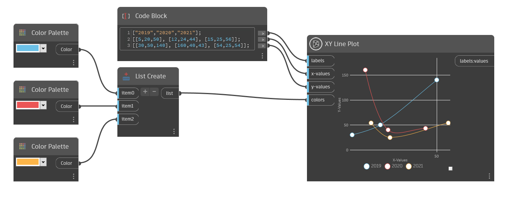

## 詳細

XY Line Plot は、x 値と y 値で 1 つまたは複数の折れ線を出力したグラフを作成します。labels 入力に文字列値のリストを入力して、折れ線にラベルを付けたり、折れ線の数を変更します。ラベルごとに新しく色分けされた折れ線が作成されます。文字列値を 1 つのみ入力すると、折れ線が 1 つのみ作成されます。

各折れ線上の各点の配置を決めるには、x-values 入力と y-values 入力に倍精度値を含むリストのリストを使用します。x-values 入力と y-values 入力の値の数を同じにする必要があります。サブリストの数も、labels 入力の文字列値の数と一致する必要があります。
たとえば、5 つの点をそれぞれ含む 3 本の折れ線を作成するには、各折れ線の名前を付けるために labels 入力に 3 つの文字列値を含むリストを入力し、x-values 入力と y-values 入力の両方に、5 つの倍精度値をそれぞれ含む 3 つのサブリストを入力します。

各折れ線に色を割り当てるには、colors 入力に色のリストを挿入します。カスタム色を割り当てる場合は、色の数が labels 入力の文字列値の数と一致する必要があります。色が割り当てられていない場合は、ランダムな色が使用されます。

___
## サンプル ファイル

