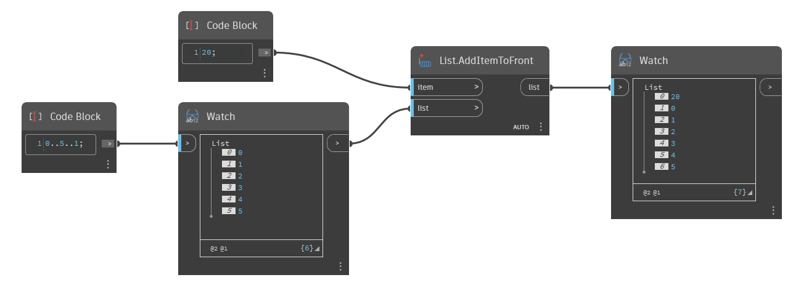

## 詳細
`List.AddItemToFront` は、指定された項目を指定されたリストの先頭に挿入します。新しい項目はインデックス 0 ですが、元の項目はインデックス 1 ですべて移動されます。追加する項目がリストの場合は、そのリストは単一のオブジェクトとして追加され、ネストされたリストが生成されることに注意が必要です。2 つのリストを組み合わせて単一のフラット リストにするには、`List.Join` を参照してください。

次の例では、コード ブロックを使用して、0 から 5 の範囲の 1 刻みの数値を生成します。次に、新しい項目である数値 20 を `List.AddItemToFront` を使用してそのリストの先頭に追加します。
___
## サンプル ファイル

