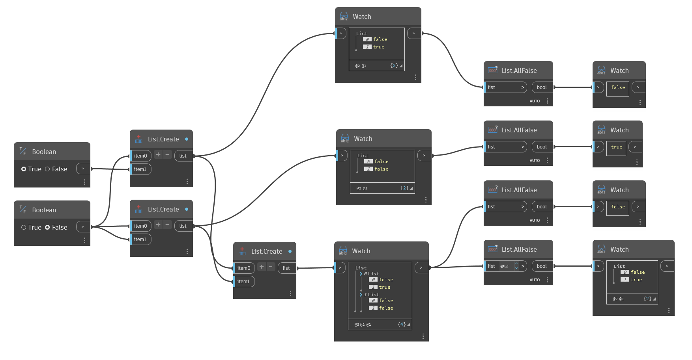

## 詳細
`List.AllFalse` は、指定したリスト内の項目が True であるかまたはブール値ではない場合に False を返します。`List.AllFalse` は、指定したリスト内のすべての項目がブール値かつ False である場合にのみ True を返します。

次の例では、`List.AllFalse` を使用してブール値のリストを評価します。最初のリストには True 値があるので、False を返します。2 番目のリストには False 値のみがあるので、True を返します。3 番目のリストには True 値を含むサブリストがあるので、False を返します。最後のノードは 2 つのサブリストを評価し、最初のサブリストについては True 値があるので False を返し、2 番目のサブリストについては False 値のみがあるので True を返します。
___
## サンプル ファイル

