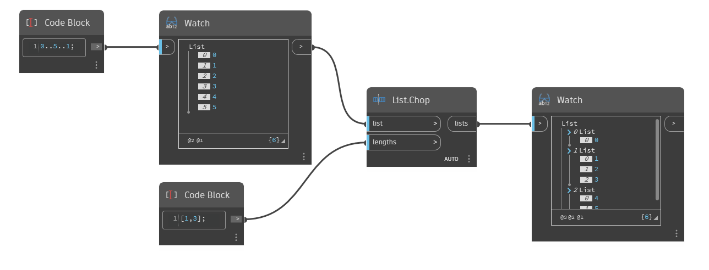

## 詳細
`List.Chop` は、入力された整数の長さのリストに基づいて、指定されたリストを小さいリストに分割します。最初のネストされたリストには、`lengths` 入力の最初の数値で指定された要素の数が含まれます。2 番目のネストされたリストには、Lengths 入力の 2 番目の数値で指定された要素の数が含まれ、以降も同様です。`List.Chop` は、入力リストのすべての要素が分割されるまで、`lengths` 入力の最後の数字を繰り返します。

次の例では、コード・ブロックを使用して、0 から 5 の範囲内の 1 刻みの数値を生成します。このリストには 6 つの要素があります。2 つ目のコード・ブロックを使用して長さのリストを作成し、1 つ目のリストを分割します。このリストの最初の数値は 1 で、`List.Chop` はその数値を使って 1 つの項目を持つネストされたリストを作成します。2 つ目の数値は 3 で、それにより 3 つの項目を持つネストされたリストが作成されます。それ以上の長さは指定されていないため、`List.Chop` には 3 つ目となる最後のネストされたリストに残りのすべての項目が含まれています。
___
## サンプル ファイル

