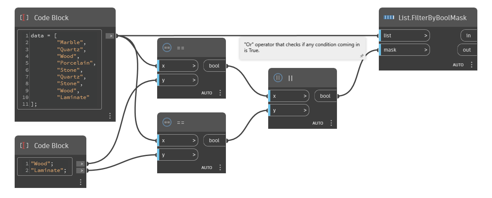

## 詳細
`List.FilterByBoolMask` は、入力として 2 つのリストを取得します。最初のリストは、対応するブール値 (True または False) のリストに従って 2 つの別々のリストに分割されます。`mask` 入力の True に対応する `list` 入力の項目は In というラベルで出力されますが、False 値に対応する項目は `out` というラベルで出力されます。

次の例では、`List.FilterByBoolMask` を使用して、マテリアルのリストから木材と積層材を選択します。まず 2 つのリストを比較して一致する項目を探し出し、次に `Or` 演算子を使用して True であるリスト項目を確認します。その次に、リスト項目は、木材、積層材、もしくはその他であるかの条件によってフィルタされます。
___
## サンプル ファイル

