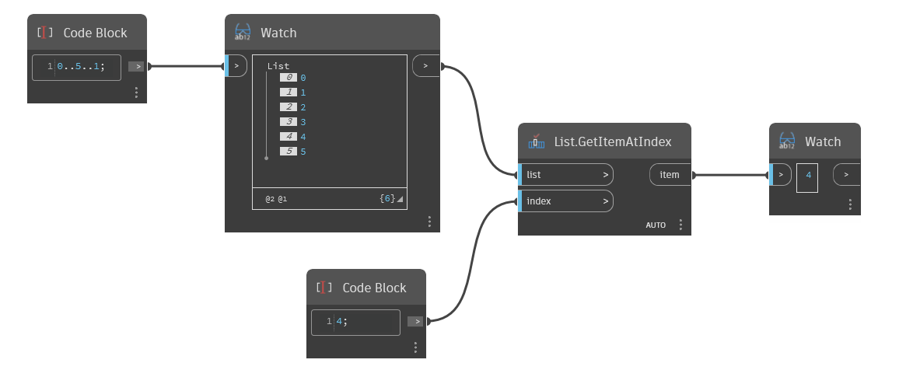

## 詳細
`List.GetItemAtIndex` は、入力リストとインデックス(整数)を取得し、指定したインデックスで見つかったリストの項目を返します。

次の例では、まずコード ブロックを使用して、0 から 5 の範囲の 1 刻みの数値を生成します。次に、`List.GetItemAtIndex` ノードを使用して、インデックス 4 の単一の要素を抽出します。
___
## サンプル ファイル

