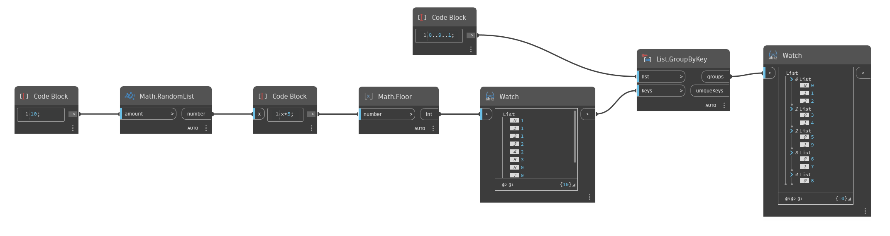

## 詳細
`List.GroupByKey` は、キーのリストに基づいて入力リストの項目をグループ化します。キーのリストには、入力リストと同じ数の要素が必要です。一致するキーに対応する元のリストの項目は、出力リストでグループ化されます。

次の例では、0 ～ 9 の範囲の数値を入力リストとして使用します。また、0 ～ 4 の範囲のランダムな数値のリストを 10 個生成してキーとして使用します。`List.GroupByKey` は、対応するキーに従ってグループ化された要素のネストされたリストを出力します。また、一意のキーのリストを出力します。
___
## サンプル ファイル

