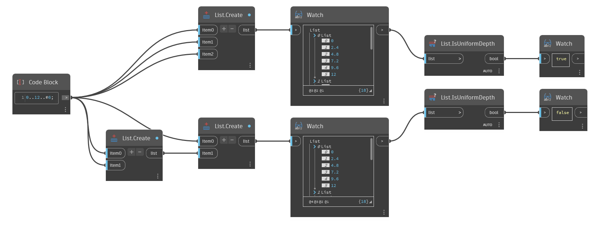

## 詳細
`List.IsUniformDepth` は、リストの深さが一致しているかどうかに基づいてブール値を返します。つまり、各リストの内部にネストされたリストの数が同じであることを意味します。

次の例では、2 つのリストを比較します。1 つは深さが均等なリストで、もう 1 つは深さが不均等なリストで、違いを示します。深さが均等なリストには、ネストされたリストを持たない 3 つのリストが含まれています。深さが不均等なリストには、2 つのリストが含まれています。この最初のリストにはネストされたリストが含まれていませんが、2 つ目のリストは 2 つのネストされたリストが含まれています。[0]のリストと[1]のリストは深さが等しくないため、`List.IsUniformDepth` は False を返します。
___
## サンプル ファイル

