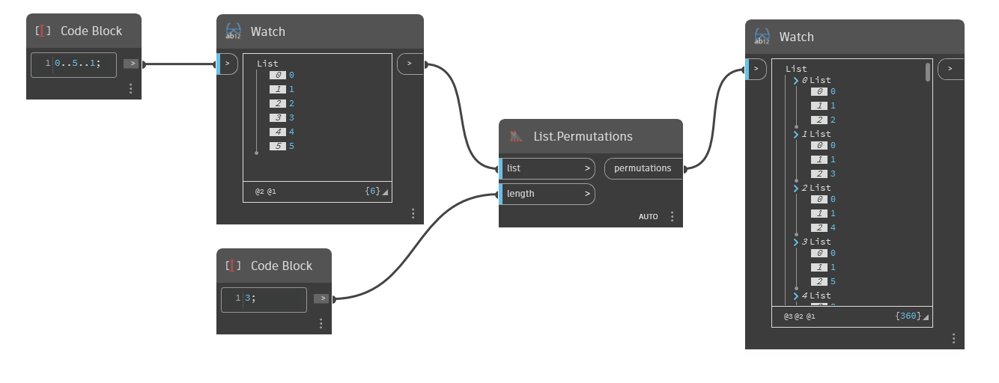

## 詳細
`List.Permutations` は、指定された入力リストから、指定された長さのすべての順列で構成されるネストされたリストを作成します。

次の例では、コード ブロックを使用して、0 から 5 の範囲の 1 刻みの数値を作成します。次に、`List.Permutations` ノードを使用し、Length 入力を 3 に設定して、[0,1,2,3,4,5]の範囲から 3 つの要素を持つすべての順列を生成します。
___
## サンプル ファイル

