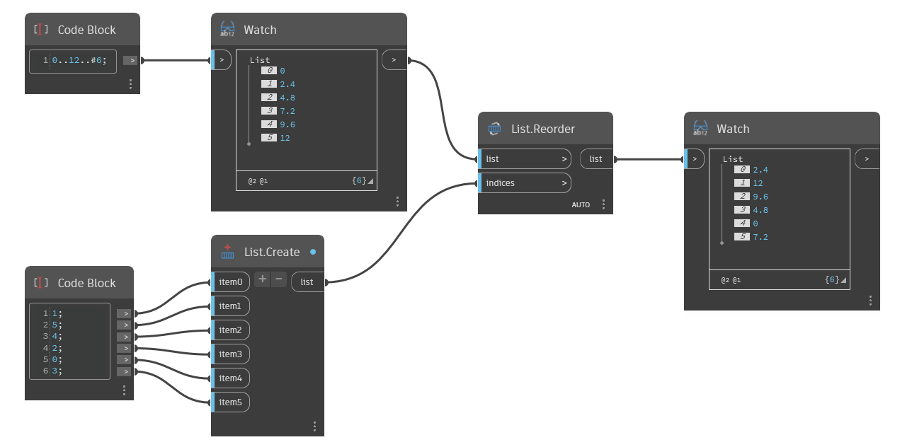

## 詳細
`List.Reorder` は、インデックスのリストに基づいて項目を並べ替えた新しいリストを返します。

次の例では、インデックスの順序を手動で変更して新しいリストを作成します。各入力インデックスは、元のリストの項目に対して新しい位置を割り当てます。たとえば、item0 は 1 なので、新しいリストの 1 番目の項目は 2.4 になり、これは元のリストのインデックス 1 に対応します。item1 は 5 なので、新しいリストの 2 番目の項目は 12 になり、これは元のリストのインデックス 5 に対応します。以後も同様に続きます。
___
## サンプル ファイル

