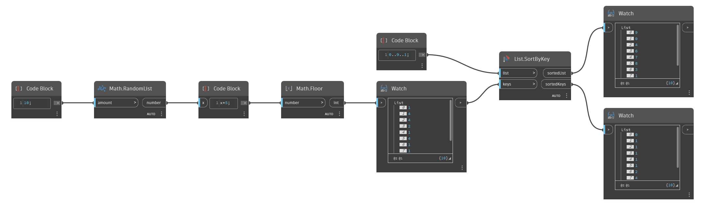

## 詳細
`List.SortByKey` は、並び替える入力リストと、対応する並べ替え可能なキー(数値や文字列など)のリストを取得します。`List.SortByKey` は、キーのリストを昇順に並べ替え、その並べ替えたキーの新しい順序に対応するように入力リストを再配置します。このノードは、再配置されたリストと並べ替えられたキーのリストの両方を出力します。

次の例では、0 ～ 9 の範囲を入力リストとして使用します。キーのリストでは、0 ～ 4 の範囲のランダムな数値のリストを 10 個生成します。キーのリストは数値によって並べ替えられ、0 ～ 9 の範囲は、キーのリストの対応する要素の順序に従って再配置されます。
___
## サンプル ファイル

