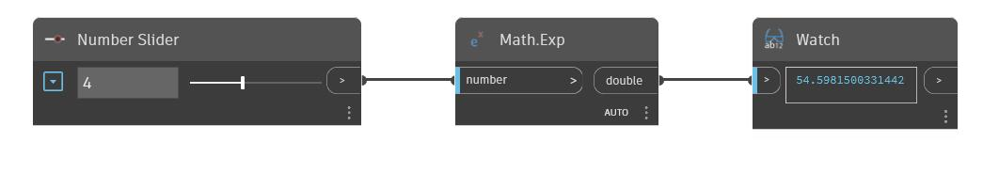

## In Depth
Exp is the exponential function with a base of 'e'. The input number is applied as an exponent to the constant 'e'. In the example below we use a number slider to control the input number to an Exp node. 
___
## Example File

