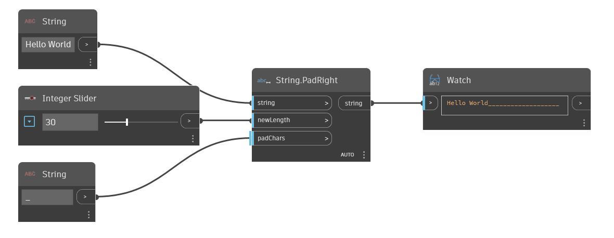

## 詳細
PadRight は、元の文字列の右側に padChars 入力を追加して、newWidth 入力に応じて入力された文字列の幅を増加します。元の文字列が newWidth 入力よりも長い場合は、このノードは元の文字列を変更せずに返します。次の例では、文字列「Hello World」を入力される文字列として使用します。追加する文字列としてアンダースコア 1 文字の文字列を使用し、整数スライダを使用して文字列の新しい幅をコントロールしています。
___
## サンプル ファイル

