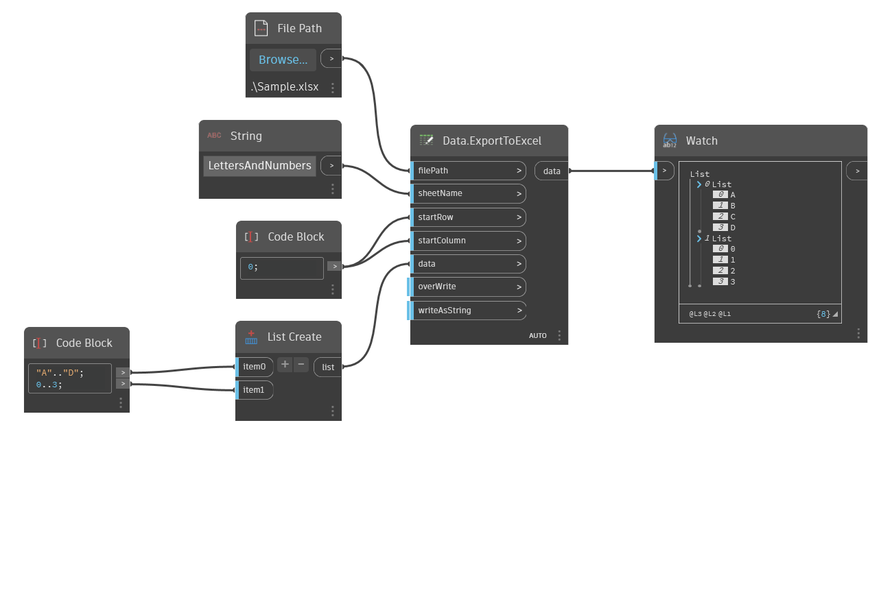

## 詳細
Data.ExportToExcel は、入力されたデータを .xlsx ファイル形式に書き出します。このノードは、開始行と開始列を整数として取得し、下流で使用するデータを出力します。overWrite 入力と writeAsString 入力を設定できます。既定では、overWrite は Excel ファイル内のすべての内容を置き換え、writeAsString はすべてのデータを強制的に文字列表現にします。

注: このノードは実行時に Excel を開きます。
___
## サンプル ファイル

