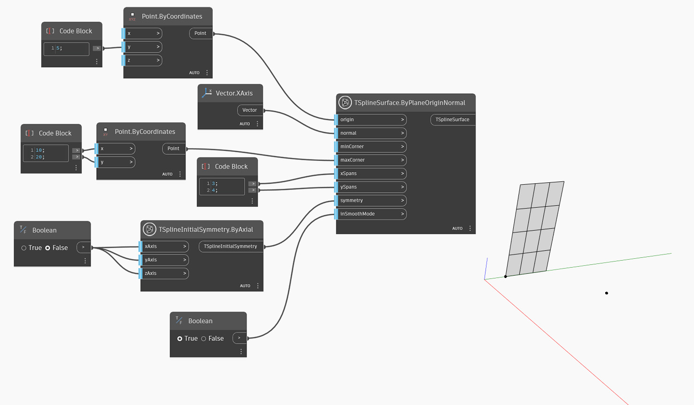

<!--- Autodesk.DesignScript.Geometry.TSpline.TSplineSurface.ByPlaneOriginNormal --->
<!--- DWYJGQGBW2MD57NAYFKR3UEMPTHASLR2IV2X2SUK3OKI35GCEVHQ --->
## In-Depth
`TSplineSurface.ByPlaneOriginNormal` は、原点と法線ベクトルを使用して T スプライン プリミティブ平面サーフェスを生成します。T スプライン平面を作成するために、ノードは次の入力を使用します。
- `origin`: 平面の原点を定義する点。
- `normal`: 作成された平面の法線方向を指定するベクトル。
- `minCorner` および `maxCorner`: 平面のコーナーで、X および Y 値を持つ点として表されます(Z 座標は無視されます)。これらのコーナーは、出力された T スプライン サーフェスが XY 平面に変換される場合の範囲を表します。`minCorner` 点と `maxCorner` 点は 3D のコーナー頂点と一致する必要はありません。たとえば、`minCorner` が(0,0)に設定され、`maxCorner` が(5,10)に設定されている場合、平面の幅と長さはそれぞれ 5 と 10 になります。
- `xSpans` および `ySpans`: 平面の幅と長さのスパン/分割数
- `symmetry`: ジオメトリが X、Y、Z 軸を基準に対称であるかどうか
- `inSmoothMode`: 結果のジオメトリをスムーズ モードとボックス モードのどちらで表示するか

次の例では、指定された原点と X 軸のベクトルである法線を使用して、T スプライン平面サーフェスを作成します。サーフェスのサイズは、`minCorner` 入力および `maxCorner` 入力として使用される 2 つの点によってコントロールされます。

## サンプル ファイル

