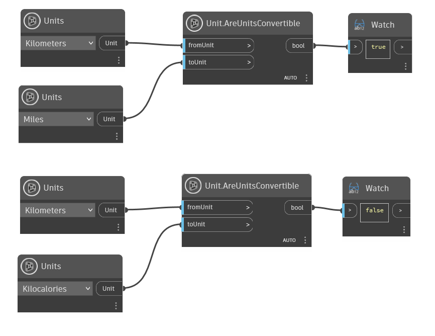

## 詳細
`Unit.AreUnitsConvertible` は、2 つの単位の入力値を受け取り、最初の単位を 2 つ目の単位に変換できるかどうかを判断します。単位が変換可能であれば True を返し、変換できない場合は False を返します。

次の例では、`Unit.AreUnitsConvertible` を使用して、まずキロメートルをマイルに変換できるかどうかを判断します。これらの単位は変換可能なので、True が返されます。2 つ目のケースでは、キロメートルはキロカロリーに変換できないため、False が返されます。
___
## サンプル ファイル

