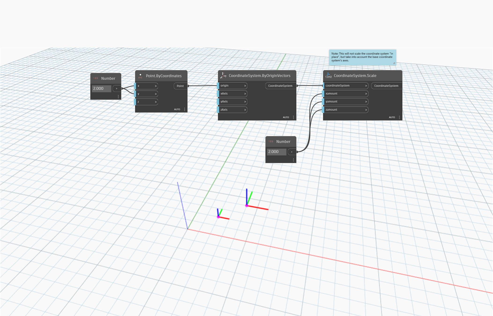

<!--- Autodesk.DesignScript.Geometry.CoordinateSystem.Scale(coordinateSystem, xamount, yamount, zamount) --->
<!--- FPPU5FCLXHQEPRW7XPEABZGTPZWIO4HFADTOKNKVF4776WBW7AMQ --->
## 詳細
`CoordinateSystem.Scale (coordinateSystem, xamount, yamount, zamount)` は、原点を中心に座標系を不均一にスケールします。

次の例では、座標の特定の点に基づいて座標系が作成され、それを `CoordinateSystem.Scale` を使用してスケールします。
___
## サンプル ファイル

