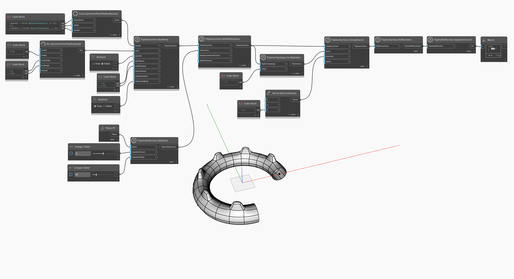

<!--- Autodesk.DesignScript.Geometry.TSpline.TSplineReflection.SegmentsCount --->
<!--- GLVHD43IRWFTZKY7UVDJ7PNERQN5Z3PWTMFYVJ537HCGJCHCQQAQ --->
## In-Depth
`TSplineReflection.SegmentsCount` は、放射状反射のセグメント数を返します。TSplineReflection のタイプが軸の場合、ノードは 0 の値を返します。

次の例では、反射を追加して T スプライン サーフェスを作成します。グラフの後半では、`TSplineSurface.Reflections` ノードを使用してサーフェスを調べています。その結果(反射)が `TSplineReflection.SegmentsCount` の入力として使用され、T スプライン サーフェスの作成に使用された放射状反射のセグメント数が返されます。

## サンプル ファイル

