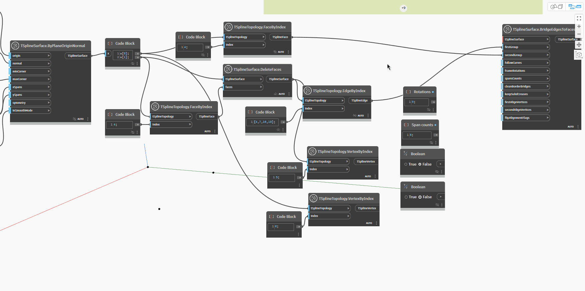

<!--- Autodesk.DesignScript.Geometry.TSpline.TSplineSurface.BridgeEdgesToFaces --->
<!--- GPVBCDN6ZVPTEE3IRF75ZGB7GIXLQYURCVYFV424TOUBVACZY44A --->
## 詳細
`TSplineSurface.BridgeEdgesToFaces` は、同じサーフェスまたは 2 つの異なるサーフェスのエッジのセットと面のセットを接続します。面を構成するエッジは、ブリッジの反対側のエッジの数と一致するか、その倍数である必要があります。ノードには、以下に説明する入力が必要です。ブリッジを生成するには最初の 3 つの入力で十分で、残りの入力は省略可能です。結果として得られるサーフェスは、最初のエッジのグループが属するサーフェスの子です。

- `TSplineSurface`: the surface to bridge
- `firstGroup`: 選択した T スプライン サーフェスのエッジ
- `secondGroup`: 選択した同じ T スプライン サーフェス、または別の T スプライン サーフェスの面。
- `followCurves`: (optional) a curve for the bridge to follow. In the absence of this input, the bridge follows a straight line
- `frameRotations`: (optional) number of rotations of the bridge extrusion that connects the chosen edges.
- `spansCounts`: (optional) number of spans/segments of the bridge extrusion that connects the chosen edges. If the number of spans is too low, certain options might not be available until it is increased.
- `cleanBorderBridges`:(optional) deletes bridges between border bridges to prevent creases
- `keepSubdCreases`:(optional) preserves the SubD-creases of the input topology, resulting in a creased treatement of the start and end of the bridge
- `firstAlignVertices`(optional) and `secondAlignVertices`: enforce the alignment between two sets of vertices instead of automatically choosing to connect pairs of closest vertices.
- `flipAlignFlags`: (optional) reverses the direction of vertices to align

次の例では、2 つの T スプライン平面を作成し、`TSplineTopology.VertexByIndex` ノードと `TSplineTopology.FaceByIndex` ノードを使用してエッジと面のセットを収集します。ブリッジを作成するために、面とエッジをサーフェスの 1 つとともに `TSplineSurface.BrideEdgesToFaces` ノードの入力として使用します。これにより、ブリッジが作成されます。`spansCounts` 入力を編集することで、さらにスパンをブリッジに追加します。`followCurves` の入力として曲線を使用する場合、ブリッジは指定された曲線の方向に従います。`keepSubdCreases`、`frameRotations`、`firstAlignVertices`、および `secondAlignVertices` 入力は、ブリッジの形状を微調整する方法を示します。

## サンプル ファイル

