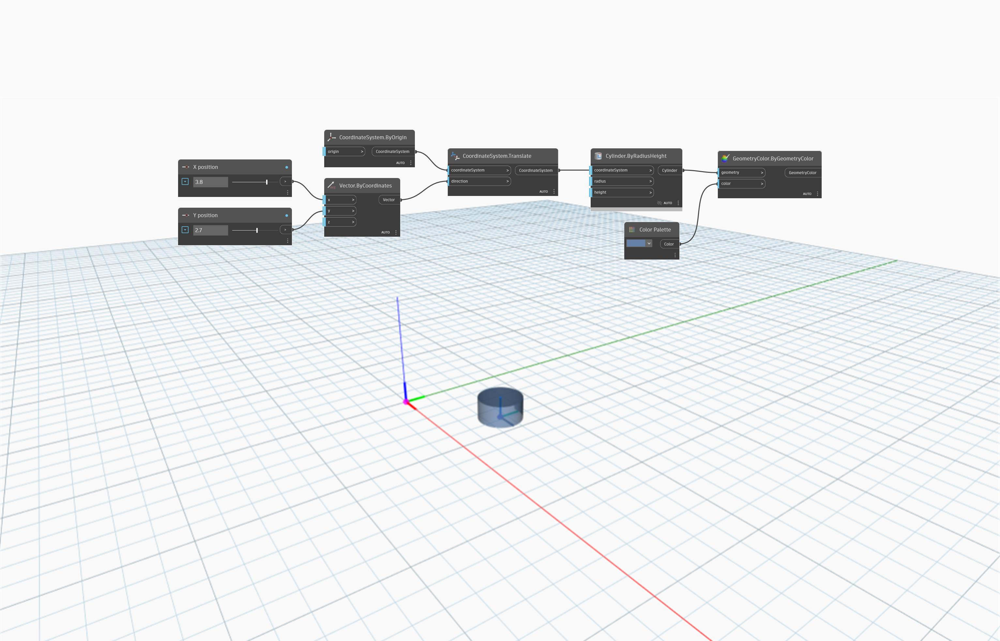

<!--- Autodesk.DesignScript.Geometry.CoordinateSystem.Translate(coordinateSystem, direction) --->
<!--- HEBF4GCPFFMBMYJFF6Z43YJXGHIM7MAZKEXMJR4UQ4BDSV22EUOA --->
## 詳細
`CoordinateSystem.Translate (coordinateSystem, direction)` は、入力ベクトル(direction)によって変換された新しい座標系を返します。

次の例では、原点の座標系は、入力ベクトル(3.8, 2.7, 0)によって定義される特定の距離と方向に変換されます。新しい座標系は、その上に作成された円柱によって識別されます。

___
## サンプル ファイル

