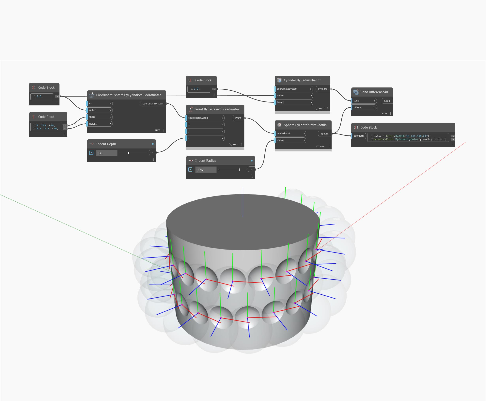

<!--- Autodesk.DesignScript.Geometry.CoordinateSystem.ByCylindricalCoordinates --->
<!--- HJVNQTWA5OIN3IEMTVCDNHS4EDEZD7QGICLE5I7LFBSR5XR6NZXQ --->
## 詳細
Point.ByCylindricalCoordinates ノードは、円柱空間内にある点を作成します。次の例では、レーシングを Cross-Reference に設定し、角度と高さの範囲を使用して、動的な半径を持つ円柱に沿って点群のグリッドを生成しています。
___
## サンプル ファイル

