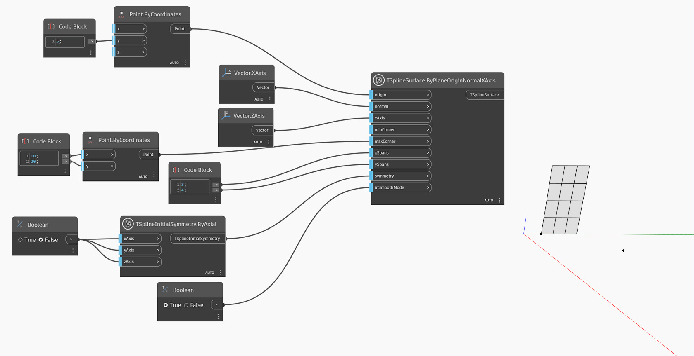

<!--- Autodesk.DesignScript.Geometry.TSpline.TSplineSurface.ByPlaneOriginNormalXAxis --->
<!--- IPJR2I55VFC67ZT5OYCCOOAEDH2AHY3CSCZKVXKIXALKV7IBDERA --->
## In-Depth
`TSplineSurface.ByPlaneOriginNormalXAxis` は、平面の原点、法線ベクトル、および X 軸のベクトル方向を使用して T スプライン プリミティブ平面サーフェスを生成します。T スプライン平面を作成するために、ノードは次の入力を使用します。
- `origin`: a point defining the origin of the plane.
- `normal`: a vector specifying the normal direction of the created plane.
- `xAxis`: X 軸の方向を定義するベクトル。作成する平面の方向をより詳細にコントロールできます。
- `minCorner` and `maxCorner`: the corners of the plane, represented as Points with X and Y values (Z coordinates will be ignored). These corners represent the extents of the output T-Spline surface if it is translated onto the XY plane. The `minCorner` and `maxCorner` points do not have to coincide with the corner vertices in 3D. For example, when a `minCorner` is set to (0,0) and `maxCorner` is (5,10), the plane width and length will be 5 and 10 respectively.
- `xSpans` and `ySpans`: number of width and length spans/divisions of the plane
- `symmetry`: whether the geometry is symmetrical with respect to its X, Y and Z axes
- `inSmoothMode`: whether the resulting geometry will appear with smooth or box mode

次の例では、指定された原点と X 軸のベクトルである法線を使用して T スプライン平面サーフェスを作成します。`xAxis` 入力は Z 軸に設定されます。サーフェスのサイズは、`minCorner` 入力および `maxCorner` 入力として使用される 2 つの点によってコントロールされます。

## サンプル ファイル

