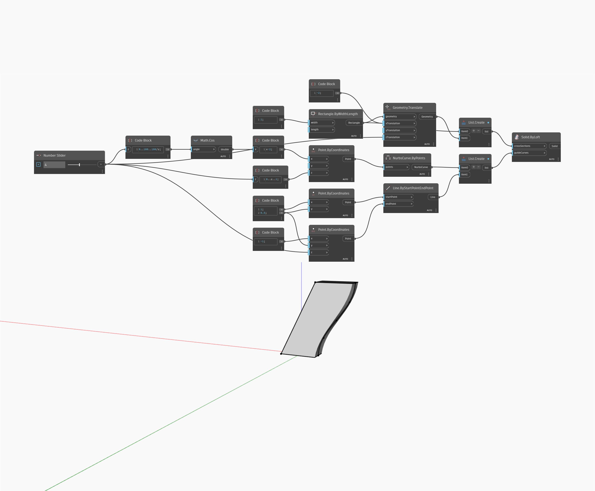

<!--- Autodesk.DesignScript.Geometry.Solid.ByLoft(crossSections, guideCurves) --->
<!--- L2FVRQ5TN5PVLYNQW2GAMUC7ERMJJMQS7TSOYXVL75IED5KQPCPQ --->
## 詳細
`Solid.ByLoft (crossSections, guideCurves)` を使用すると、ガイド曲線のリストを入力して、ロフトされたソリッドのペリメータに沿って異なるプロファイルを生成できます。

次の例では、`crossSections` として 2 つのオフセット長方形を使用します。ペリメータの周囲に 2 つの異なるガイド曲線が生成されます。1 つは余弦関数に基づき、もう 1 つは単純な線分に基づきます。

___
## サンプル ファイル

