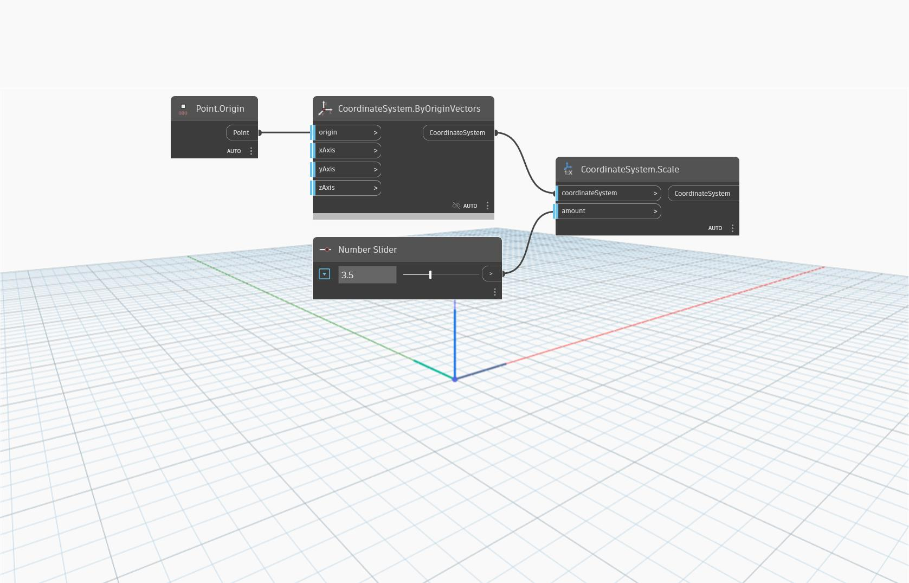

<!--- Autodesk.DesignScript.Geometry.CoordinateSystem.Scale(coordinateSystem, amount) --->
<!--- LH2OMC6QECNGXILBERSJIZPNQ7BJYOSSOBDJC2VICMMYXJ7BJRUA --->
## 詳細
`CoordinateSystem.Scale (coordinateSystem, amount)` は、係数によってスケールされた新しい座標系を返します。

次の例では、原点の座標系が係数 3.5 でスケールされています。結果として得られる座標系のベクトルの長さとスケール係数は 3.5 です。スライダを調整すると、さまざまなスケール係数を指定できます。
___
## サンプル ファイル

