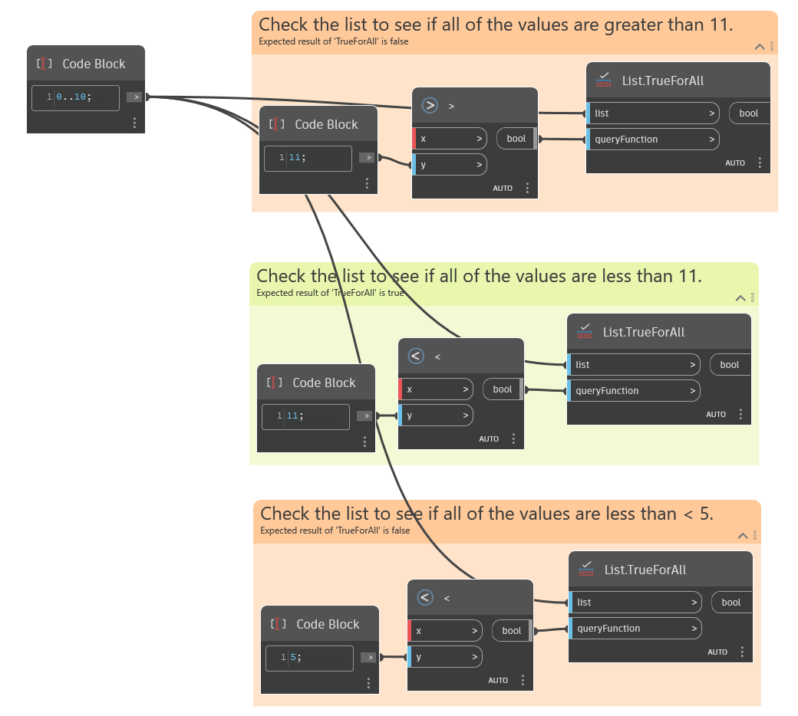

## 詳細
`List.TrueForAll` は、リストのすべての項目に対して `queryFunction` 入力の条件が True かどうかを示すブール値を返します。`queryFunction` 入力は、ブール値である必要があります。

次の例は、入力リストの評価に使用される 3 つの関数を示しています。最初の関数は、リスト内のすべての値が 11 より大きいかどうかを大なり(>)ノードを使用して評価し、False を返します。2 番目の関数は、リスト内のすべての値が 11 より小さいかどうかを小なり(<)ノードを使用して評価し、True を返します。3 番目の関数は、リスト内のすべての値が 5 より小さいかどうかを小なり(<)ノードを使用して評価し、False を返します。
___
## サンプル ファイル

