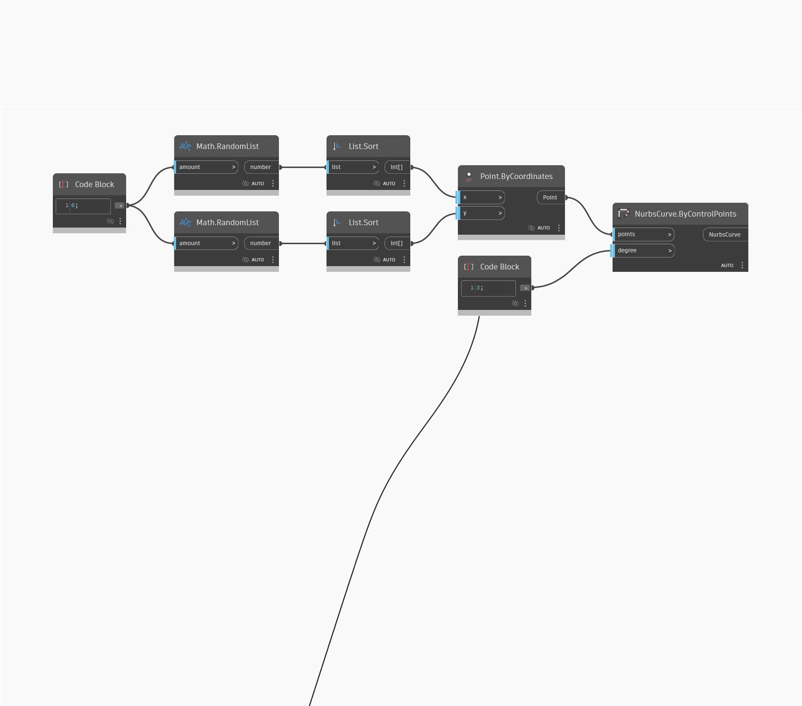

<!--- Autodesk.DesignScript.Geometry.NurbsCurve.ByControlPoints(points, degree) --->
<!--- M7MZHZHWH4ZKVKUYXLRW627FB62D73CFFTQ2Q4CDDYU24PMN4A2A --->
## 詳細
NurbsCurve.ByControlPoints は、NurbsCurve を描画するための制御点のリストを入力します。また、曲線の次数もコントロールできます。次の例では、ワールド座標系の XY 平面上に 4 つのランダムな点を生成し、X 方向と Y 方向に点を順に接続します。
___
## サンプル ファイル

