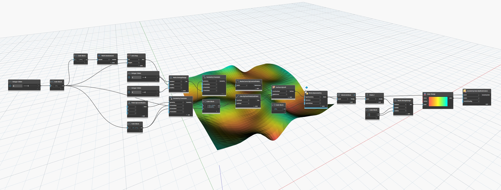

## 詳細
`GeometryColor.ByMeshColor` は、GeometryColor オブジェクトを返します。このオブジェクトは、指定された色のリストに従って色付けされたメッシュです。このノードを使用するには、いくつかの方法があります。

- 1 つの色が指定されている場合、メッシュ全体が 1 つの指定された色で色付けされます。
- 色の数が三角形の数と一致する場合、各三角形はリストの対応する色に色付けされます。
- 色の数が一意の頂点の数と一致する場合、メッシュにおける各三角形の色は、各頂点の色値の間で補間されます。
- 色の数が一意でない頂点の数と等しい場合、各三角形の色は面全体における色値の間で補間されますが、面間でブレンドされることはありません。

## 例

次の例では、メッシュは頂点の高さに基づいて色分けされています。まず、`Mesh.Vertices` を使用してメッシュにおける一意の頂点を取得し、それを分析して、`Point.Z` ノードを使用して各頂点の高さを取得します。次に、`Map.RemapRange` を使用して各値を比例的にスケールし、値を 0 ～ 1 の新しい範囲にマッピングします。最後に、`Color Range` を使用して、マッピングされた値に対応する色のリストを生成します。この色のリストを `GeometryColor.ByMeshColors` ノードの `colors` 入力として使用します。結果として、各三角形の色が頂点の色間で補間され、グラデーションで色分けされたメッシュが生成されます。

## サンプル ファイル

