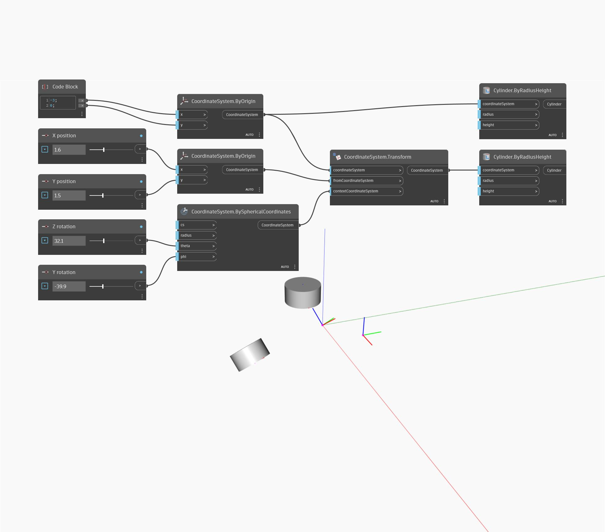

<!--- Autodesk.DesignScript.Geometry.Geometry.Transform(geometry, fromCoordinateSystem, contextCoordinateSystem) --->
<!--- OC4QHO6N4KYVUT4GX3X6NKCYO22OJ6JU6DCATPIKSF4G7DF6CZJA --->
## 詳細
このジオメトリをソースの CoordinateSystem から新しいコンテキストの CoordinateSystem に変換します。
___
## サンプル ファイル

