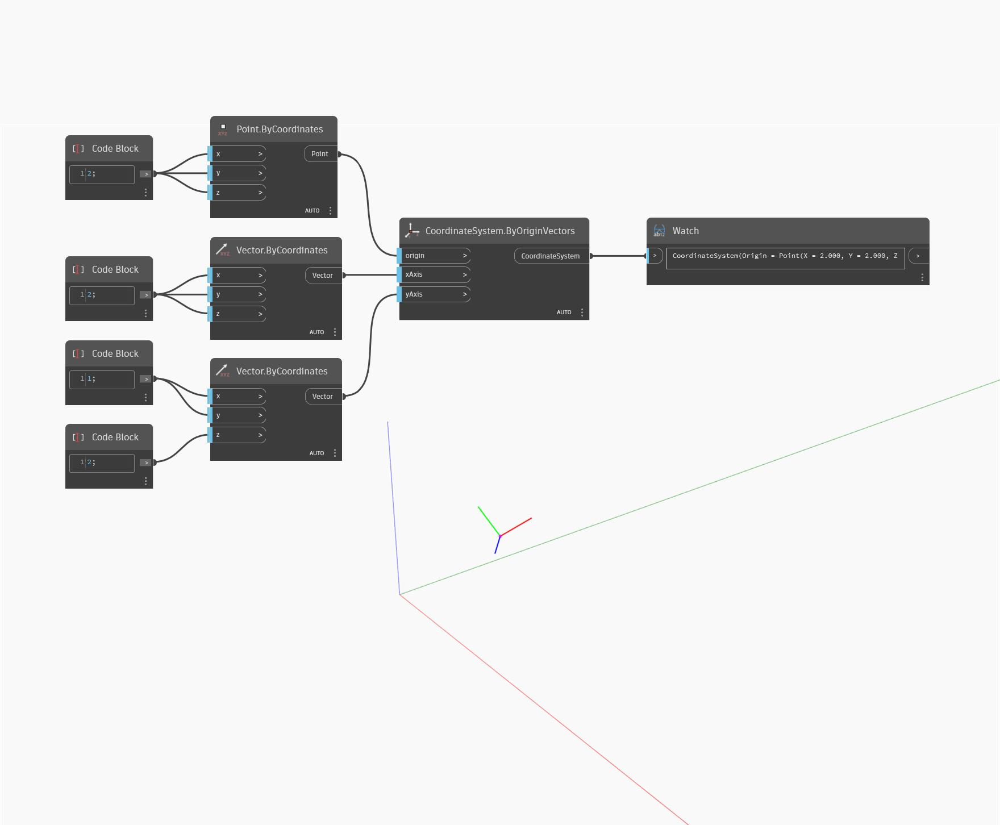

<!--- Autodesk.DesignScript.Geometry.CoordinateSystem.ByOriginVectors(origin, xAxis, yAxis) --->
<!--- OH554N4PUDZNL4VT5CUWEDPC3OHVKCDBCOPHIXQAIDMNWPFEREUQ --->
## 詳細
ByOriginVectors (origin, xAxis, yAxis)は、入力された原点の位置に、入力された X 軸および Y 軸の新しい CoordinateSystem を返します。次の例では、CoordinateSystem が新しいベクトルを X 軸と Y 軸にして原点に配置されています。結果の CoordinateSystem は、元の CoordinateSystem に対して回転しています。
___
## サンプル ファイル

