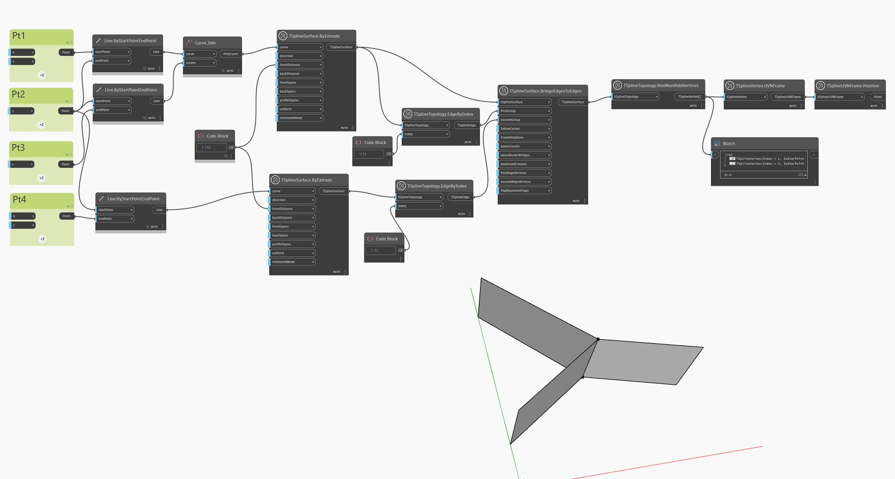

<!--- Autodesk.DesignScript.Geometry.TSpline.TSplineTopology.NonManifoldVertices --->
<!--- OIJALKI73VKASCFK5TTWV255GAJ6VI4DQDKA5BCILT7GMGHVQ3CA --->
## In-Depth
`TSplineTopology.NonManifoldVertices` は、T スプライン モデルから非多様体の頂点を特定するために使用されます。非多様体 T スプライン サーフェスはボックス モードでのみ表示できます。

次の例では、同じエッジを共有する 2 つのサーフェスを結合した結果、非多様体 T スプライン サーフェスが作成されます。`TSplineTopology.NonManifoldVertices` ノードと `TSplineUVNFrame.Position` ノードは、非多様体の頂点をハイライト表示するために使用されます。

## サンプル ファイル

