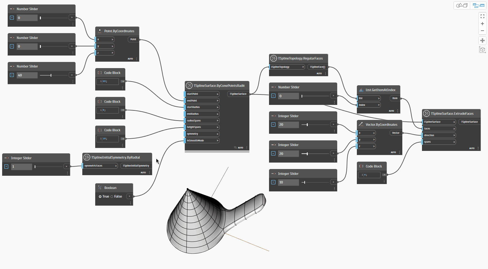

<!--- Autodesk.DesignScript.Geometry.TSpline.TSplineInitialSymmetry.ByRadial --->
<!--- PK6P6YKREOU7DHO6OXJFT6PUF5LSO2W7ZW4IOTGWYPW3BJYASCOQ --->
## In-Depth
`TSplineInitialSymmetry.ByRadial` defines if the T-Spline geometry has radial symmetry. Radial symmetry can only be introduced for T-Spline primitives that allow it - Cone, Sphere, Revolve, Torus. Once established at the creation of the T-Spline geometry, radial symmetry influences all subsequent operations and alterations. 

A desired number of `symmetricFaces` needs to be defined in order to apply the symmetry, with 1 being the minimum. Regardless of how many radius and height spans the T-Spline surface has to begin with, it will be further split into the chosen number of `symmetricFaces`.

In the example below, the `TSplineSurface.ByConePointsRadii` is created and radial symmetry is applied through the use of the `TSplineInitialSymmetry.ByRadial` node. The nodes `TSplineTopology.RegularFaces` and `TSplineSurface.ExtrudeFaces` are then used to respectively select and extrude a face of the T-Spline surface. The extrusion is applied symmetrically, and the slider for the number of symmetric faces demonstrates how the radial spans are subdivided.

## Example File

